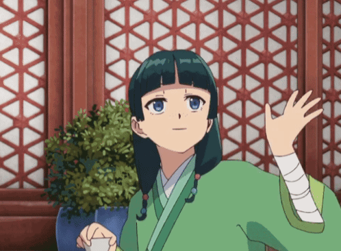

<!-- 🌸 Tanvi Khicchi — Anime-Inspired GitHub Profile (Attack on Titan × Apothecary Diaries Theme) -->

  

  <b>“The world is cruel, but also very beautiful.”</b> — Mikasa Ackerman 

<h1 align="center">⚔️ Tanvi Khicchi</h1>
<h3 align="center">“Code like a Scout. Think like an Apothecary.”</h3>

### 🌸 About Me
> “Curious like Maomao. Fearless like the Scouts.”

- 🎓 B.E. in **Information Technology (2023–2027)** | DBIT, Mumbai  
- ✍️ Write tech reflections on [**Medium**](https://medium.com/@tanvikhicchi)  
- 💬 Fluent in **MERN Stack, Python, Flask, FastAPI, Django, HTML, CSS, JavaScript, React**

---

### ⚙️ Tech Stack

---

### 📊 GitHub Stats

  
  

  

---

### 🌐 Connect With Me

---

  

 <b>“Curiosity is a disease that can’t be cured.”</b> — Maomao  

<h4 align="center">“In a world full of noise, I build things that speak quietly — with purpose.” 🪷</h4>

---
